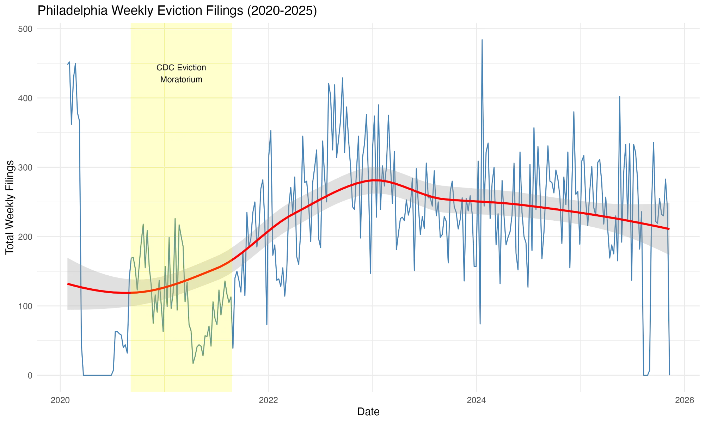
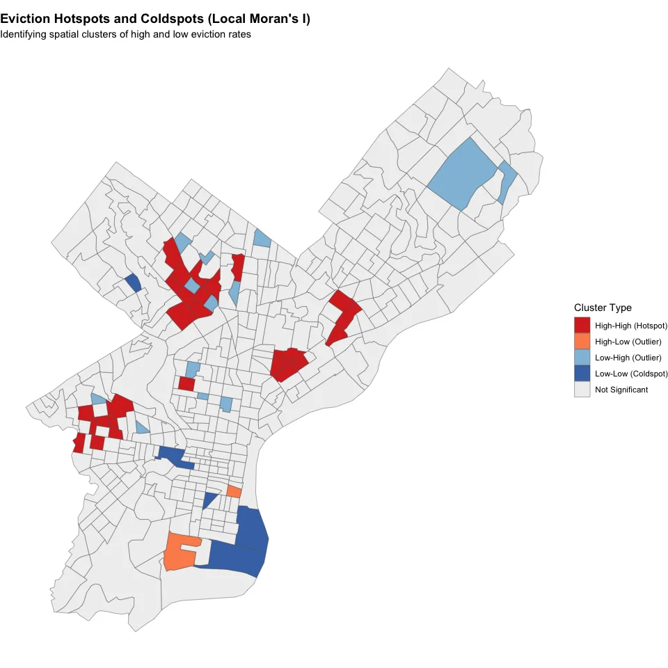
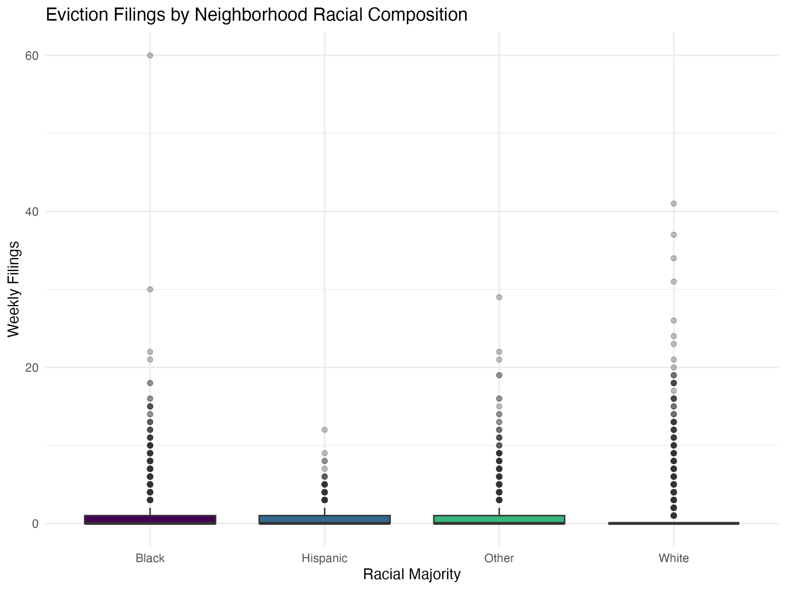
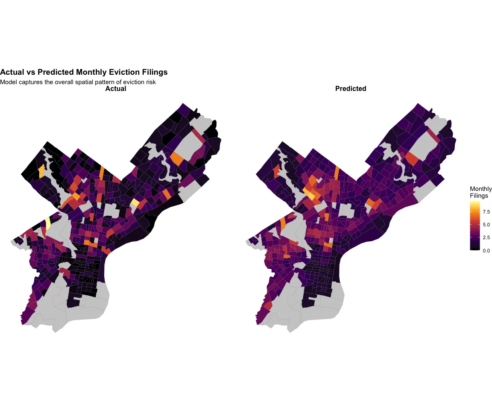
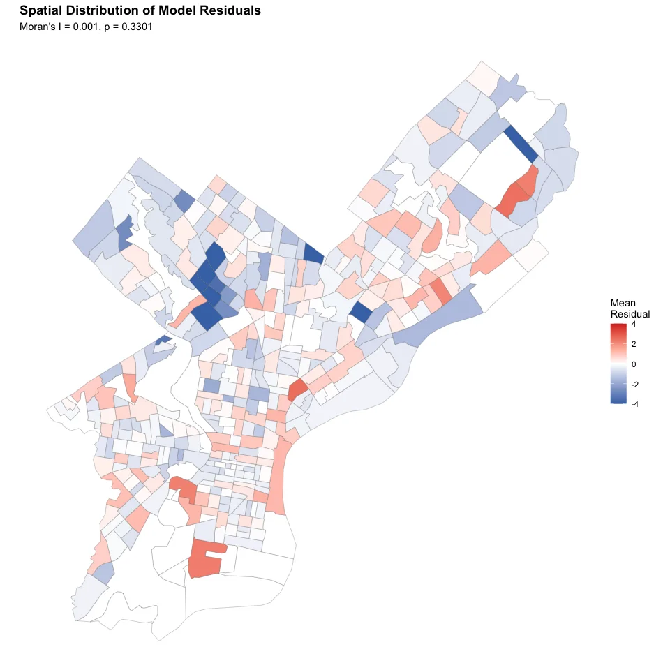
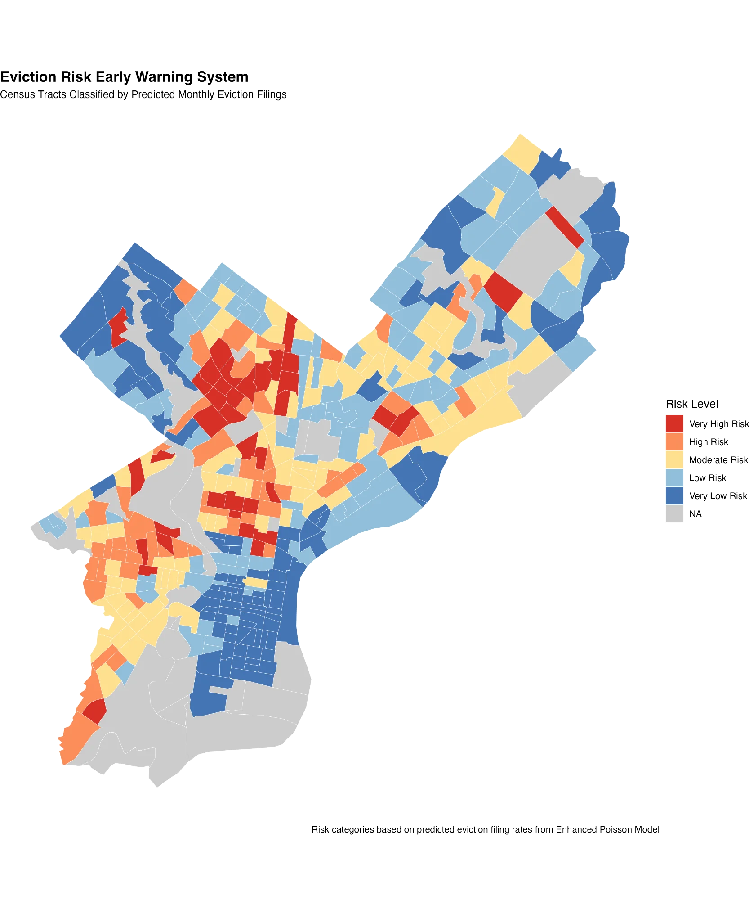
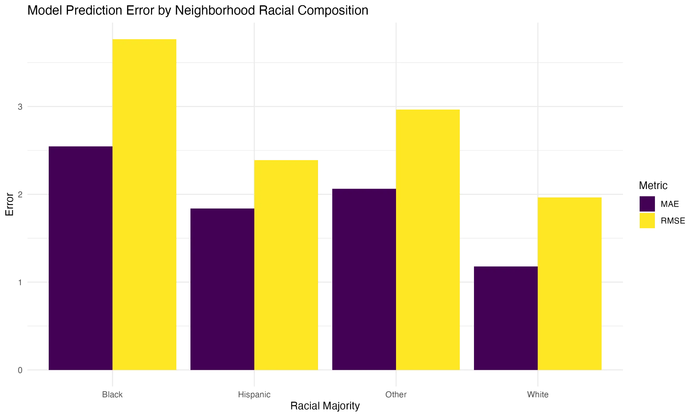

# The Problem

## Philadelphia's Eviction Crisis

**The numbers are staggering:**

- **1,000+** eviction filings per month
- Families lose homes, kids switch schools, credit destroyed
- Eviction rates among highest in the nation

. . .

**But many evictions are preventable** — with timely intervention

## The Key Question

::: {.callout-important}
## Can we predict which neighborhoods will have the most evictions next month?
:::

If we can identify high-risk areas **before** evictions happen, we can:

- Deploy legal aid teams
- Offer rental assistance  
- Connect tenants with resources

**Goal:** Intervene *before* the crisis, not after

# Our Approach

## What Data Did We Use?

::: {style="font-size: 0.5em;"}
:::: {.columns}

::: {.column width="33%"}
**Eviction Records**

- Monthly court filings
- All 408 Census tracts
- 2020 - 2025
- Source: Eviction Lab
:::

::: {.column width="33%"}
**Neighborhood Data (Census)**

- Poverty rate
- % Renters
- Median income
- Unemployment rate
- % Rent burdened (>30% income)
- Vacancy rate
- % Old housing (pre-1970)
- % College educated
:::

::: {.column width="33%"}
**311 Complaints**

- No heat / utilities
- Dangerous building
- Infestations
- Maintenance issues
- Building code violations
- Aggregated monthly by tract
:::

::::
:::

**Why 311?** Early warning sign — tenants report problems before eviction happens

## Why Monthly Data?

| Metric | Weekly | Monthly |
|--------|--------|---------|
| Zero proportion | 68.4% | 34% |
| Observations | 114,534 | 26,082 |

**Monthly aggregation reduces zero-inflation** — creating a more tractable modeling problem while preserving meaningful variation.

# Key Findings

## Finding 1: Evictions Follow Clear Patterns

{fig-align="center" width="85%"}

Yellow = CDC moratorium period. After it ended, evictions surged back — but predictably.

## Finding 2: Geographic Clustering

{fig-align="center" width="65%"}

**Hotspots (Red):** North Philly, West Philly, Southwest | **Coldspots (Blue):** Center City, Far Northeast

## Finding 3: Racial Disparities Exist

{fig-align="center" width="70%"}

Majority-Black neighborhoods have more outliers with very high eviction counts.

# Model Performance

## We Tested Multiple Models

::: {style="font-size: 0.7em;"}
| Model | Variables | McFadden's R² |
|-------|-----------|---------------|
| Baseline | Last month's evictions, 2 months ago | 0.14 |
| Full | + Neighbor evictions, demographics, race | 0.23 |
| Enhanced | + Hotspot features, month effects, interactions | 0.24 |
:::

**Neighbor evictions (spatial lag):** Average evictions in nearby tracts — captures "spillover effect"

**Month effects:** Seasonal patterns (e.g., more evictions in Jan/Feb after holidays)

**Interactions:** Effect of one variable depends on another (e.g., poverty has stronger effect in high-renter areas)

## Model Performance on Test Set

| Model | MAE | RMSE | Correlation |
|-------|-----|------|-------------|
| Baseline | 1.92 | 2.49 | 0.285 |
| Full Poisson | 1.82 | 2.49 | 0.368 |
| Neg. Binomial | 1.89 | 2.95 | 0.312 |
| **Enhanced** | **1.78** | **2.41** | **0.442** |

*Lower MAE/RMSE = better. Higher correlation = better.*

## Actual vs Predicted: Spatial Comparison

{fig-align="center" width="90%"}

Model captures the overall spatial pattern of eviction risk across Philadelphia.

## Model Residuals: Spatial Check

{fig-align="center" width="60%"}

Moran's I = 0.001, p = 0.33 — **No significant spatial autocorrelation in residuals!** ✓

## What This Means in Practice

:::: {.columns}

::: {.column width="50%"}
**We CAN:**

- Identify high-risk neighborhoods
- Rank areas by eviction risk
- Guide resource allocation
:::

::: {.column width="50%"}
**We CAN'T:**

- Predict exact number of evictions
- Identify specific households
- Predict sudden policy changes
:::

::::

**Bottom line:** Good enough to prioritize resources, not precise enough to replace human judgment

# The Early Warning System

## Risk Classification Map

{fig-align="center" width="70%"}

Red/Orange areas = Priority for intervention

## Equity Check: Does the Model Work Fairly?

{fig-align="center" width="70%"}

Model error is higher in majority-Black neighborhoods — we need to monitor this.

# Recommendations

## Three Action Steps

:::: {.columns}

::: {.column width="33%"}
### 1. Deploy to High-Risk Areas

Use this map to send:

- Legal aid teams
- Rental assistance
- Community education
:::

::: {.column width="33%"}
### 2. Monitor Monthly

Update predictions to:

- Catch emerging hotspots
- Track intervention effects
- Adjust as needed
:::

::: {.column width="33%"}
### 3. Combine with Local Knowledge

This tool **supports** — not replaces:

- Case manager expertise
- Community input
- On-the-ground observations
:::

::::

## Limitations

:::: {.columns}

::: {.column width="50%"}
**Data & Model**

- Filings ≠ actual evictions
- Neighborhood-level only
- Temporal scope: 2020-2025 (COVID era)
- Can't predict policy shocks
:::

::: {.column width="50%"}
**Ethics & Mitigation**

- Risk of stigmatizing areas
- Higher error in Black neighborhoods
- Decision *support*, not replacement
- Access to results should be controlled
:::

::::

# Summary

## Key Takeaways

::: {.incremental}
1. Evictions are **predictable** — past patterns tell us where future problems will be

2. They **cluster geographically** — focus resources on hotspots

3. **Racial disparities persist** even after controlling for income

4. This tool helps **prevent evictions** by targeting help *before* the crisis
:::

## Questions?

::: {.r-fit-text}
Thank you!
:::

**Data Sources:** Eviction Lab, Census ACS, Philadelphia 311
